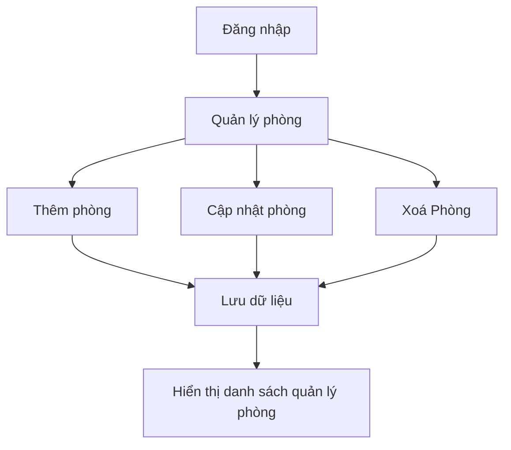

# MODULE ROOM MANAGEMENT

## Attributes (Thuộc tính)
| Thuộc tính| Kiểu dữ liệu |
|-----------|--------------|
| Mã Phòng  | INT          |
| Số phòng  | INT          |
| Loại Phòng| String       |
| Tầng      | INT          |
| Sức chứa  | INT          |
| Diện Tích | float        |
| Trạng thái| String       |
| Mô tả     | String       |
| Hình ảnh  | VARCHAR(255) |
| Ghi Chú   | String       |

# Luồng Hoạt Động

## ADMIN 

**Quyền**
- Thêm, xoá, sửa  thông tin phòng.
- Thay đổi trạng thái phòng.
- Quản lý hình ảnh của phòng
